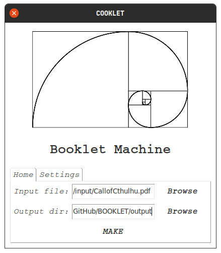

# BOOKLET

Python program, using Tkinter, to convert dinA4 paper PDF to an easy-to-print and easy-to-sew book

Home             |  Settings
:-------------------------:|:-------------------------:
 | 
 | 
